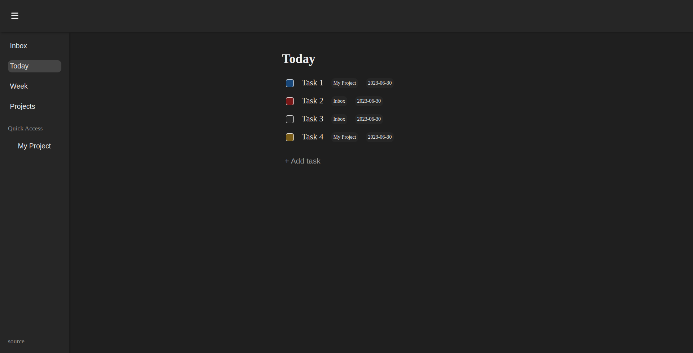

# Todo List

A todo list web app created with JavaScript

## About the App

The project is from [The Odin Project](https://www.theodinproject.com/lessons/node-path-javascript-todo-list) curriculum.

### Features

- Views: inbox, today, week, list of projects and specific tasks of a project
- Tasks: title, description, project, priority and date
- Projects: title, description, favorite
- Have local storage
- It's support responsive design

### Tools and technology

- Visual Studio Code
- Linux Terminal
- Font Awesome Icons
- Figma
- Git and GitHub
- HTML and CSS
- JavaScript
- Webpack

### Learnings

- Better understanding of webpack
- Use of local storage

## Screenshot

## Acknowledgements

- Project idea by [The Odin Project](https://www.theodinproject.com/)
- Web icon from [favicon](https://favicon.io/)

## Author

[Sergio García](https://github.com/sergiogarciiam)

## License

This project is open source and available under the [MIT License](./LICENSE).
